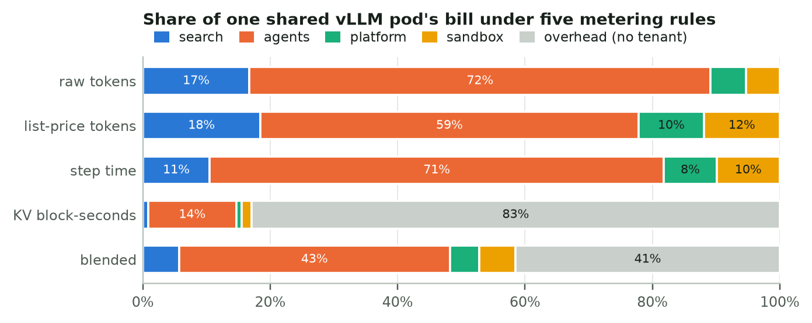

# unalloc

**Find the AI spend nobody owns.** Joins OpenCost allocation data with LLM provider bills and reports what's unattributed.

[](https://github.com/timurista/unalloc/actions/workflows/ci.yml)
[](LICENSE)
[](pyproject.toml)

OpenCost tells you what your Kubernetes workloads cost. Your provider dashboard tells you what your OpenAI and Anthropic calls cost. Neither tells you what a single AI feature costs, because the two live in different systems with different keys. `unalloc` pulls both into one normalized ledger, joins them on a label dimension you choose, and reports the number your finance team keeps asking for: how much of this month's AI spend can't be attributed to any team.

## The output

```
$ unalloc report --fixtures --dimension team

╭──────────────────────────── unalloc ─────────────────────────────╮
│ 73.5% of $66,630.38 AI spend is unattributed                     │
│ $48,983.14 has no 'team' label                                   │
╰──────────────────────────────────────────────────────────────────╯

                        Spend by team
┏━━━━━━━━━━━━━━━━━┳━━━━━━━━━━━━━┳━━━━━━━┳━━━━━━━━━━━━━━━━━━━━━━━━━━━━━━━━━━━━━┳━━━━━━┓
┃ team            ┃        Cost ┃ Share ┃ Sources                               ┃ Rows ┃
┡━━━━━━━━━━━━━━━━━╇━━━━━━━━━━━━━╇━━━━━━━╇━━━━━━━━━━━━━━━━━━━━━━━━━━━━━━━━━━━━━━━╇━━━━━━┩
│ platform        │  $13,166.02 │ 19.8% │ litellm, opencost                     │    2 │
│ search          │   $4,481.22 │  6.7% │ litellm, opencost                     │    2 │
│ <unallocated>   │  $48,983.14 │ 73.5% │ anthropic, litellm, opencost, openai  │   11 │
└─────────────────┴─────────────┴───────┴───────────────────────────────────────┴──────┘
```

Then the actionable half: a labeling backlog sorted by dollars.

```
$ unalloc labels --fixtures --dimension team

      Labeling backlog — rows missing 'team', by cost
┏━━━━┳━━━━━━━━━━┳━━━━━━━━━━━━━━━━━━━━━━━━━━━┳━━━━━━━━━━━━┳━━━━━━━━━━━━━━━━━━━━━━━━━━━━┓
┃  # ┃ Source   ┃ Cost object               ┃       Cost ┃ Labels it does have        ┃
┡━━━━╇━━━━━━━━━━╇━━━━━━━━━━━━━━━━━━━━━━━━━━━╇━━━━━━━━━━━━╇━━━━━━━━━━━━━━━━━━━━━━━━━━━━┩
│  1 │ opencost │ inference/vllm-llama-70b  │ $19,147.10 │ cluster, controller, ...   │
│  2 │ opencost │ __idle__                  │  $6,070.00 │ cluster                    │
│  3 │ litellm  │ claude-opus-5             │  $5,412.75 │ environment, model         │
└────┴──────────┴───────────────────────────┴────────────┴────────────────────────────┘
```

`inference/vllm-llama-70b` is the whole pitch: $19K of GPU spend carrying a `costCenter` label but no `team`, sitting next to $5K of Claude API spend on an unlabeled legacy key. Two systems, one gap, no existing tool that shows them in the same table.

Add a fallback and unalloc says how much of the "allocated" spend only got there through it, so a fallback onto something that is not an owner can't hide inside the headline:

```
$ unalloc report --fixtures -D team --fallback namespace
│ 37.9% of $66,630.38 AI spend is unattributed                     │
│ $25,237.54 has no 'team' label                                   │
│ $23,745.60 attributed only via fallback (namespace)              │
```

## Install

```bash
pip install unalloc          # or: uv tool install unalloc
unalloc report --fixtures    # works immediately, no infrastructure needed
```

From a clone:

```bash
make dev      # editable install with test + lint tooling
make demo     # all three commands against bundled fixtures
make check    # ruff + pytest, same as CI
```

Or as a container, which needs no Python on the host:

```bash
docker build -t unalloc:0.1.0 .
docker run --rm unalloc:0.1.0 report --fixtures -D team

# against real systems, reachable from the container
docker run --rm --network host --env-file .env unalloc:0.1.0 report -D team
```

Copy `.env.example` to `.env` for the source configuration. unalloc stores
nothing: no database, no state directory, no cached credentials.

## Usage

```bash
# What percentage of spend has no owner?
unalloc report --dimension team --days 30

# Accept a second-best key before declaring a row unallocated
unalloc report -D team --fallback namespace --fallback cost_center

# Fail a CI job when more than 10% of spend is unowned
unalloc report -D team --budget 10

# Which label keys does my data actually have?
unalloc labels --available

# The backlog honours the same fallbacks as the report
unalloc labels -D team --fallback namespace

# Does the ledger tie out to the invoice?
unalloc reconcile --invoice openai=4031.36 --invoice anthropic=8737.03

# Pipe it into something else
unalloc report --json | jq '.unallocated_pct, .fallback_usd'
```

Configure sources by environment variable:

| Variable | Purpose |
| --- | --- |
| `UNALLOC_OPENCOST_URL` | OpenCost API root, e.g. `http://opencost.opencost:9003` |
| `UNALLOC_LITELLM_URL` | LiteLLM proxy root |
| `UNALLOC_LITELLM_KEY` | LiteLLM master or admin key |
| `OPENAI_ADMIN_KEY` | OpenAI org admin key (costs endpoint) |
| `ANTHROPIC_ADMIN_KEY` | Anthropic org admin key (cost report endpoint, sent as `x-api-key`) |
| `UNALLOC_OPENAI_URL`, `UNALLOC_ANTHROPIC_URL` | Optional overrides for the public API roots, e.g. a proxy |

Restrict the run with `--source` to avoid double counting: if your traffic goes through LiteLLM, prefer `--source opencost --source litellm` and skip the direct provider adapters, since the same tokens appear in both. The [end-to-end case study](#case-studies-and-paper) measures exactly how much that costs you if you forget.

## How it works

```
  OpenCost /allocation ─┐
  LiteLLM /spend/logs  ─┤
  OpenAI  org costs    ─┼──▶ normalize (label canonicalization + aliases)
  Anthropic cost report ┘              │
                                       ▼
                                    CostRow[]
                                       │
                      ┌────────────────┼────────────────┐
                      ▼                ▼                ▼
                  attribute        reconcile          labels
              (unallocated %)   (vs invoice)     (backlog by $)
```

Everything rests on one dataclass. An adapter's only job is turning a provider payload into `CostRow`s; it never aggregates, filters or decides anything about attribution. Adding a provider is one file and one fixture.

Two design choices worth calling out:

**Money is `Decimal`, never `float`.** Attribution that disagrees with the invoice by a cent per row is how you lose an argument with finance.

**Label canonicalization is the actual hard part.** OpenCost gives you `label_costCenter`. LiteLLM gives you `team_id` or a `team:platform` request tag. OpenAI gives you a project ID. None of those join on a naive dict lookup, so every adapter runs its labels through `normalize.py` first, which strips provider prefixes (repeatedly, so `label_app_kubernetes_io_name` and `app.kubernetes.io/name` agree), converts camelCase, and applies an alias table you can extend per-org. When two raw keys land on the same canonical key, a fixed precedence decides - explicit key, then alias, then rewritten key, then path-derived key - so the result never depends on the order a provider serialized its labels in.

## Case studies and paper

Five studies push real (or realistically simulated) inference workloads through unalloc's own adapters. They exposed nine defects in the tool along the way, all fixed with regression tests, and they're written up as a paper: **[paper/unalloc-case-studies.pdf](paper/unalloc-case-studies.pdf)**.

| Study | What runs | Headline |
| --- | --- | --- |
| [`kv_cache`](case_studies/kv_cache) | Discrete-event vLLM-style engine: paged KV blocks, prefix caching, continuous batching, preemption | Step-time metering shows ~0% idle once any request is in flight; KV-memory metering leaves a large share of the bill unowned |
| [`torch_kv`](case_studies/torch_kv) | A from-scratch PyTorch decoder with a real KV cache serving a 4-tenant trace | Per-token showback over-charges a RAG tenant by 33 points of the pool ($5.7K/month) vs measured compute |
| [`distributed`](case_studies/distributed) | Tensor and pipeline parallel on `torch.distributed` (gloo), verified against a single-process reference | Owner label on LeaderWorkerSet leaders only: 66% unallocated; falling back to `name` "fixes" it by sending 61% to a Helm chart name |
| [`hybrid_e2e`](case_studies/hybrid_e2e) | The real CLI as a subprocess against live mock OpenCost / LiteLLM / OpenAI / Anthropic APIs (Postgres-backed LiteLLM in the dev container) | Enabling every source double counts $11.8K; reading only page one of the billing APIs reports 25% of spend |
| [`use_cases`](case_studies/use_cases) | Labeling Pareto, per-feature unit economics, self-host break-even, CI budget gate | Three label fixes take a 67%-unallocated org under 10% |

```bash
make research            # CPU torch, notebook tooling, typst
make case-studies        # all five, full size (a few minutes)
make paper               # figures + PDF
make notebook            # execute case_studies/unalloc_case_studies.ipynb
make ui                  # ledger explorer on http://127.0.0.1:8765
```



The **ledger explorer** (`python -m case_studies.ui`) shows every dataset row by row: pick the label that means "owner", add fallbacks, and watch each row resolve to a team, a fallback value, or the backlog. `python -m case_studies.ui --export explorer.html` writes a self-contained copy you can share.

## Development environment

An isolated dev stack lives in [`.devcontainer/`](.devcontainer): a Python 3.11 workspace with the case-study dependencies (CPU-only PyTorch) and a small Postgres that backs the mock LiteLLM spend-log store. Open the folder in VS Code's Dev Containers, or from a terminal:

```bash
make devcontainer          # docker compose up
make devcontainer-check    # lint, tests and every case study at smoke size, inside the container
```

## Scope, and what this is not

OpenCost 1.121.0 added inference cost tracking for vLLM and llm-d deployments: cost per million tokens, KV-cache-corrected pricing, shared infrastructure attribution. That is excellent and `unalloc` does not reimplement it. Those rows arrive through the same `/allocation` shape and land in this ledger tagged `unalloc_layer=inference`.

What OpenCost structurally cannot do is see your OpenAI and Anthropic bills, because they aren't Kubernetes objects. What LiteLLM cannot do is see your GPU nodes. `unalloc` lives in exactly that seam and nowhere else. It is:

- **not** a dashboard — it prints a number and exits (the explorer is a case-study companion, not part of the CLI)
- **not** an optimizer — it makes no recommendations about rightsizing or commitments
- **not** a collector — it queries systems you already run, and stores nothing

## Roadmap

- [ ] Prometheus exporter so `unalloc_unallocated_ratio` can be alerted on
- [ ] OpenCost external-cost plugin, so LLM API spend appears natively in OpenCost
- [ ] Per-feature unit economics using the `quantity`/`unit` fields already carried on `CostRow`
- [ ] Azure OpenAI and Bedrock adapters
- [x] `--budget` mode: exit non-zero when unallocated share crosses a threshold, for CI
- [ ] `--exclude label=value` on a source, so gateway traffic can be dropped from provider billing instead of whole sources
- [ ] Warn when distinct raw label keys collide on one canonical key

## Contributing

Adding a source is deliberately small: implement `parse()` on a `Source` subclass, add a fixture to `src/unalloc/fixtures/`, add a case to `tests/test_sources.py`. The fixtures are the contract, so a PR with a real (scrubbed) payload from a provider is valuable even without the adapter.

```bash
pip install -e ".[dev]"
ruff check . && pytest
```

## License

Apache 2.0, matching OpenCost.
