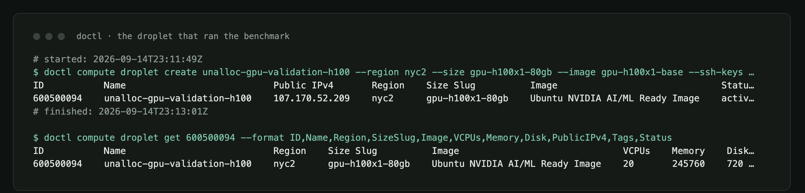
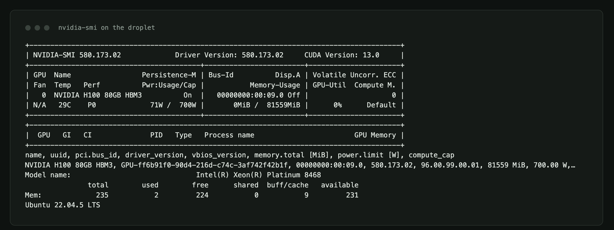
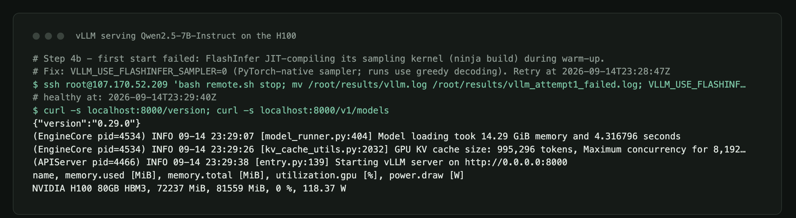
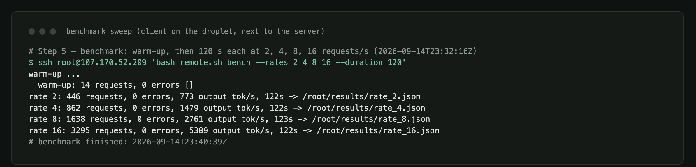
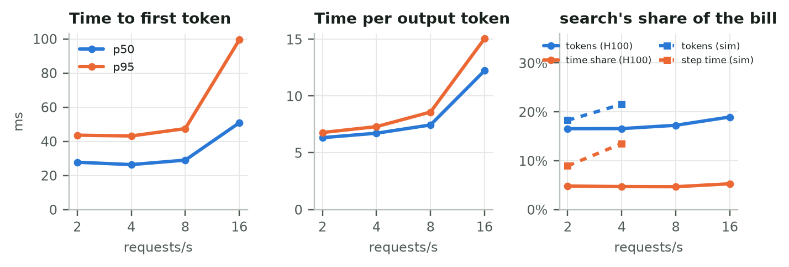
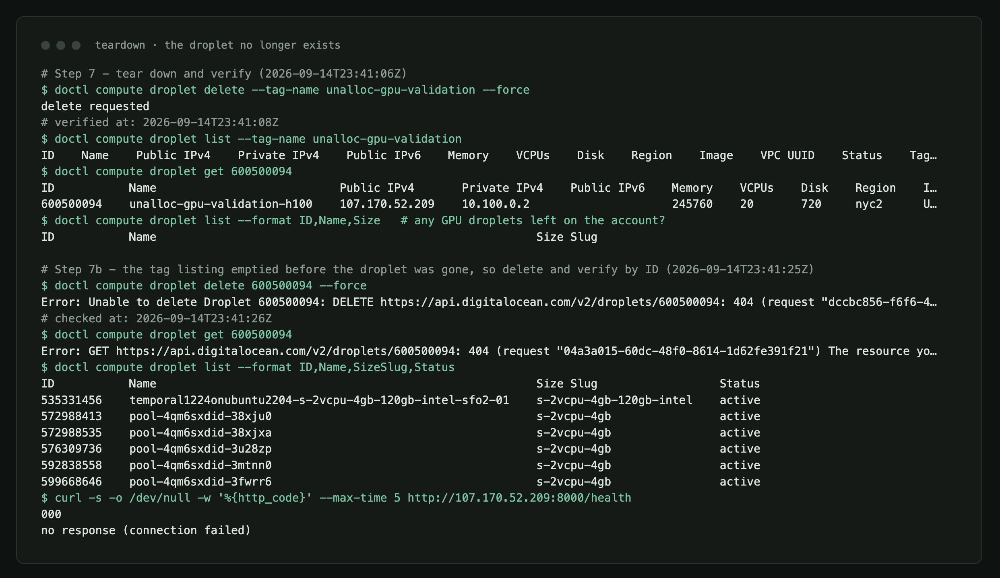

# Addendum: Verified on a Real H100

*An attachment to "[Who Pays for the KV Cache?](who-pays-for-the-kv-cache.md)". The main post's PyTorch timings came from a CPU. This addendum re-runs the metering experiment with production serving software on a datacenter GPU, and shows exactly how the machine was brought up, verified and torn down.*

---

## TL;DR

- **The main finding holds on real hardware.** On an NVIDIA H100 running vLLM, token-based showback charged the RAG tenant **12–14 percentage points** more of the bill than its measured share of serving time, at every load I tested.
- **GPU "utilization" is not a cost signal.** `nvidia-smi` reported **97% utilization at 2 requests/s and 99% at 16 requests/s**, while throughput rose 7×. Power draw was the honest signal: 469 W → 660 W.
- **Latency stayed low.** Median time to first token was 26–51 ms and median time per output token 6.3–12.2 ms, even at 16 requests/s with no requests queued.
- **My simulator was too pessimistic.** Its latency model saturates at 8 requests/s; the real H100 never queued a request at 16. The attribution *shares* still agreed in direction, but the simulator needs calibrating.
- **The whole run cost about $2.15**: 29 minutes of a $4.41/hour DigitalOcean GPU Droplet.

## The machine

| | |
| --- | --- |
| Provider | DigitalOcean GPU Droplet `gpu-h100x1-80gb`, region `nyc2` |
| Image | DigitalOcean "NVIDIA AI/ML Ready" (Ubuntu 22.04.5 LTS) |
| GPU | 1× NVIDIA H100 80GB HBM3 · driver 580.173.02 · CUDA 13.0 · 700 W limit |
| CPU / RAM | 20 vCPU Intel Xeon Platinum 8468 · 235 GB |
| Serving | vLLM 0.29.0 · PyTorch 2.13.0+cu130 · Python 3.12 |
| Model | `Qwen/Qwen2.5-7B-Instruct`, bf16, 8,192-token context, prefix caching on |
| KV cache | 995,296 tokens (14.3 GiB of weights, 72 GB of GPU memory in use) |
| Lifetime | created 23:11:49 UTC, deleted 23:41:08 UTC on 2026-09-14 |

Everything in the table was captured from the machine itself, not typed from a spec sheet:







## What ran

The benchmark client reused the serving simulator's four tenants: **search** (RAG with long prompts and short answers), **agents** (multi-turn sessions that re-send the conversation), **platform**, and an unlabeled **sandbox** key. Prompts were sent as token IDs, so lengths were exact and shared system prompts were byte-identical, which is what prefix caching keys on. Output lengths were forced with `min_tokens` and `ignore_eos`, and decoding was greedy.

After a 10-second warm-up that would abort on any error, the client ran two minutes each at 2, 4, 8 and 16 requests/s. It ran **on the droplet, next to the server**, so the latency numbers measure serving, not the internet. For scale: my laptop's round trip to the droplet was 91 ms, which a remote user would add on top.



## Results

| Load | Requests | Errors | Output tok/s | Prefix-cache hits | TTFT p50 / p95 | Time per token p50 | GPU util | Power |
| --- | ---: | ---: | ---: | ---: | ---: | ---: | ---: | ---: |
| 2 req/s | 446 | 0 | 773 | 67% | 28 / 44 ms | 6.3 ms | 97% | 469 W |
| 4 req/s | 862 | 0 | 1,479 | 79% | 26 / 43 ms | 6.7 ms | 99% | 499 W |
| 8 req/s | 1,638 | 0 | 2,761 | 78% | 29 / 47 ms | 7.4 ms | 99% | 547 W |
| 16 req/s | 3,295 | 0 | 5,389 | 66% | 51 / 99 ms | 12.2 ms | 99% | 660 W |



### 1. Token metering still mis-prices the RAG tenant

I computed the same meters as in the main post, this time from real telemetry: token counts from the server's usage block, and a time-share meter that splits every 50 ms of wall time equally across in-flight requests.

| Load | search · tokens | search · time share | Gap |
| --- | ---: | ---: | ---: |
| 2 req/s | 16.5% | 4.8% | +11.7 pts |
| 4 req/s | 16.6% | 4.7% | +11.9 pts |
| 8 req/s | 17.2% | 4.6% | +12.6 pts |
| 16 req/s | 18.9% | 5.2% | +13.7 pts |

At 2 requests/s the simulator predicted 18.3% by tokens against 8.9% by step time, a 9.4-point gap. The H100 confirms the direction and roughly the size. Search's answers finished in 0.26–0.51 s at the median, while an agent turn took 1.8–3.3 s, and a token meter can't see that difference.

### 2. "The GPU is at 99%" tells you nothing about cost

Continuous batching keeps some request in flight almost all the time: vLLM reported at least one running request in 97–100% of samples at every load. `nvidia-smi`'s utilization counter tracks that, not how hard the GPU is working. Meanwhile the KV cache was between 0.7% and 8% full, because a 995,296-token pool is provisioned for peaks.

If your chargeback divides a GPU bill by "utilization", a pod serving 773 tokens/s and one serving 5,389 tokens/s look identical. **Power draw** (469 W → 660 W) and **tokens processed** moved with load; utilization didn't.

### 3. Where the simulator was wrong

The simulator's step-latency constants were set by hand for an 8B model on an H100. Against the real engine it matched throughput below saturation (737 vs 773 output tokens/s at 2 requests/s), but it saturates at 8 requests/s, with multi-second time to first token, while the real server handled 16 requests/s with nothing queued. The model also differs: Qwen2.5-7B's grouped-query attention stores about 57 KB of KV per token against the simulator's 131 KB. Calibrating the simulator's constants from this run is the obvious next step. Until then, trust its *shares*, not its latency.

## How I brought it up, verified it, and tore it down

The full, copy-pasteable runbook is in the repo at [`case_studies/gpu_validation/RUNBOOK.md`](https://github.com/timurista/unalloc/blob/main/case_studies/gpu_validation/RUNBOOK.md), with every command's captured output under [`case_studies/results/gpu_validation/evidence/`](https://github.com/timurista/unalloc/tree/main/case_studies/results/gpu_validation/evidence). In short:

1. **Dry-run first, for free.** A fake vLLM server on my laptop exercised the benchmark client before any GPU was rented.
2. **Create the droplet** with `doctl compute droplet create … --size gpu-h100x1-80gb --image gpu-h100x1-base --tag-names unalloc-gpu-validation`. The cheaper 48 GB L40S and RTX 6000 Ada sizes ($1.57/h) had no capacity in any region that day.
3. **Arm a watchdog immediately:** a local background job that deletes anything with the tag after 55 minutes, whatever else happens.
4. **Verify the hardware** with `nvidia-smi`, `lscpu` and DigitalOcean's own droplet record, before installing anything.
5. **Install and serve:** `uv`, vLLM and the repo, with the 15 GB model downloading in parallel. Setup took about 10 minutes.
6. **Benchmark**, copy the raw results back, then **delete the droplet**.
7. **Verify by ID, not by tag.** Deleting by tag detaches the tag first, so the tag listing went empty while `doctl compute droplet get <id>` still showed the droplet `active`. I deleted by ID and waited for a 404 before stopping the watchdog.



Two things went wrong, and both are in the evidence rather than edited out:

- **vLLM's first start failed.** Version 0.29.0 JIT-compiles a FlashInfer sampling kernel during warm-up, and that build failed on this image. Setting `VLLM_USE_FLASHINFER_SAMPLER=0` falls back to the PyTorch sampler, which gives identical results for greedy decoding. The failed log is kept as `vllm_attempt1_failed.log.gz`.
- **A shell quirk cost me four minutes.** zsh doesn't word-split an `ssh …` command stored in a variable, so my first setup command never ran. A shell function fixed it.

## Caveats

- One GPU and one model, with a two-minute window per load level and a single run each.
- The time-share meter splits wall time across in-flight requests, including any queueing. The server reported zero waiting requests throughout, so here that is serving time.
- Multi-turn prompts append synthetic assistant tokens rather than the model's actual output, so prefix reuse across turns covers the previous prompt but not the previous answer.
- Prices are DigitalOcean's on-demand list prices on the day of the run.

## Reproduce it

```bash
python -m case_studies.gpu_validation.fake_server --port 8011 &           # free dry run
# then follow case_studies/gpu_validation/RUNBOOK.md on any single-GPU machine
python -m case_studies.gpu_validation.analyze                              # local analysis
python -m case_studies.gpu_validation.render_evidence                      # the images above
```

*Code and raw data: [github.com/timurista/unalloc](https://github.com/timurista/unalloc). All figures and terminal captures are by the author.*
