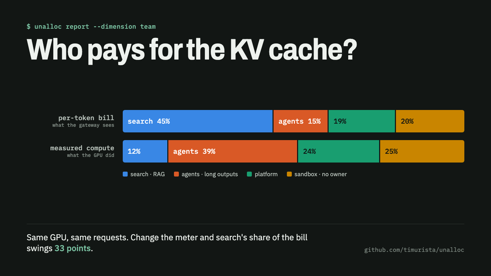
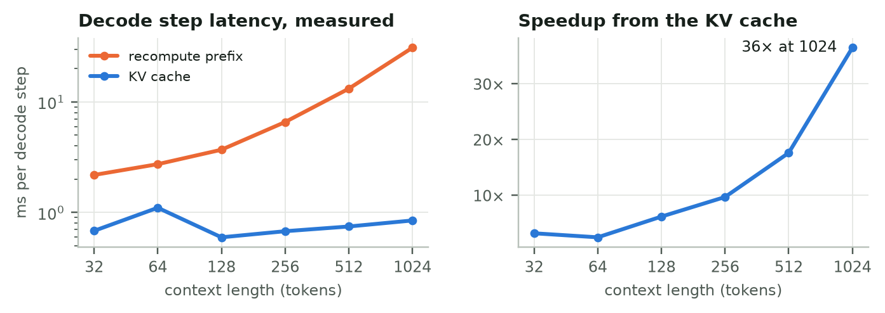
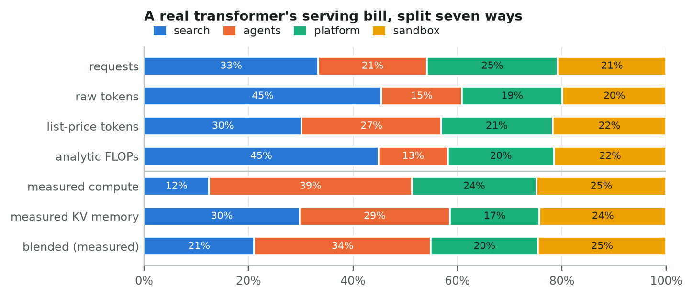
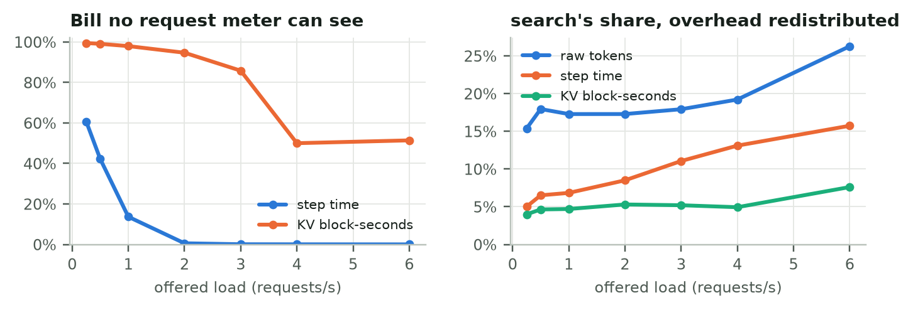
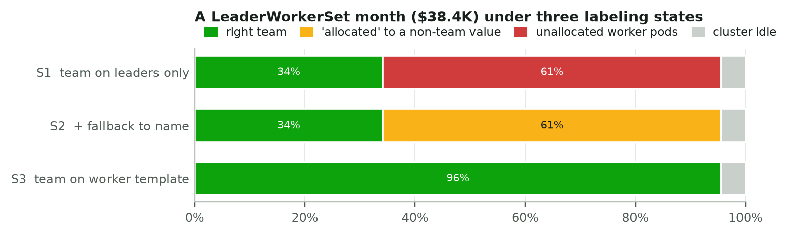
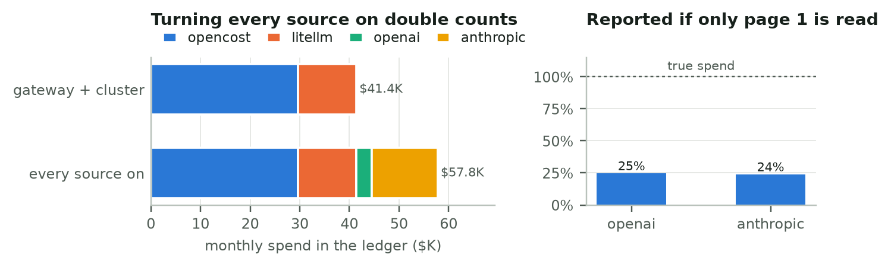
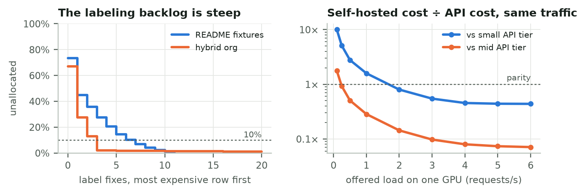

# Who Pays for the KV Cache?

*I pushed real transformer inference, a vLLM-style serving simulator and `torch.distributed` through an open-source cost ledger. The metering rule moved a third of the bill.*



---

Ask an ML platform team what a single AI feature costs and you'll usually get two answers that don't add up.

The Kubernetes side, often OpenCost, knows what your GPU pods cost. The API side, meaning your LiteLLM gateway plus the OpenAI and Anthropic billing consoles, knows what your tokens cost. A retrieval-augmented "answer" feature touches both: a vector database and an embedding job on the cluster, maybe a self-hosted model on a GPU pool, and a frontier model behind the gateway. Neither system can tell you what the feature costs, and neither can tell you the number finance actually wants: **how much of this month's AI spend belongs to nobody?**

I built a small tool for that question, [unalloc](https://github.com/timurista/unalloc). Then I tried to break it with inference workloads that behave like production, and wrote the results up as a [paper](https://github.com/timurista/unalloc/blob/main/paper/unalloc-case-studies.pdf). This post is the readable version: what I measured, what surprised me, and what I'd tell a data science team that is about to set up showback for LLM costs.

## The tool in sixty seconds

`unalloc` pulls OpenCost allocations, LiteLLM spend logs and the OpenAI and Anthropic organization cost APIs into one normalized ledger. Every row is a `CostRow`: a source, a name, a `Decimal` amount (never a float), and canonicalized labels. Then it groups that ledger on whichever label you say means "owner":

```bash
pip install unalloc
unalloc report --fixtures --dimension team
```

```
╭──────────────────────────── unalloc ─────────────────────────────╮
│ 73.5% of $66,630.38 AI spend is unattributed                     │
│ $48,983.14 has no 'team' label                                   │
╰──────────────────────────────────────────────────────────────────╯
```

The unglamorous hard part is labels. OpenCost gives you `label_costCenter`, LiteLLM gives you `team_id` or a `team:search` request tag, and OpenAI gives you a project ID. None of those join with a dictionary lookup, so every adapter canonicalizes keys before anything else happens.

A tool that prints one percentage is only as good as the data behind it. So I built five case studies that generate that data the way real systems do.

## Experiment 1: a real transformer with a real KV cache

I wrote a small decoder-only transformer in PyTorch: 3.3M parameters, rotary embeddings, and an explicit, preallocated KV cache. Before timing anything, I checked that cached decoding produces exactly the same tokens as recomputing the whole prefix at every step. The largest logit difference was 1e-6.



The KV cache does what the textbooks say: at 1,024 tokens of context a decode step takes 0.85 ms instead of 30.9 ms, 36× faster. That isn't the interesting part.

The interesting part came when I served a 96-request trace from four "teams" with different shapes:

- **search**: RAG, long prompts (400–700 tokens), short answers
- **agents**: short prompts, long outputs
- **platform**: somewhere in between
- **sandbox**: a shared key with no owner

Then I split one month of the pod's GPU bill ($17,280 for 8 GPUs) seven different ways.



Count tokens, which is what a gateway does, and search pays **45%** of the pod. Measure the compute the requests actually used and search pays **12%**. Prefill is batched and cheap; decode is sequential and expensive. Search sent 18,024 prompt tokens and got 701 back, while agents sent 2,345 and got 4,017 back.

> Per-token showback over-charged the RAG team by **33 percentage points** of the bill, $5,703 a month, relative to measured compute. Pricing output tokens at 4× input, like API list prices do, halves the gap. It doesn't close it.

The size of that gap is specific to my hardware; I ran this on a CPU, where per-step overhead is large. The direction is structural: under token pricing, prompt-heavy workloads subsidize decode-heavy ones.

## Experiment 2: a shared vLLM pod, simulated

A CPU transformer doesn't batch like a production server, so I also wrote a discrete-event simulator of a vLLM-style engine. It has paged KV blocks, automatic prefix caching, chunked prefill inside a shared token budget, continuous batching and recompute preemption. The agents tenant runs multi-turn sessions that re-send the whole conversation each turn, which is exactly the workload prefix caching was invented for.

At a sustainable 3 requests per second the engine served 10,020 requests in half an hour, with a 75% prefix-cache hit rate and a median time-to-first-token under 100 ms. (My first choice, 4 req/s, looked healthy for five simulated minutes. Over thirty, agent follow-ups piled up and time-to-first-token passed 40 seconds. Run your load tests long enough.)


Two things jump out:

1. **Step-time metering can't see idle capacity.** With continuous batching there is almost always *some* request in flight, so the pod looks 100% busy while producing half the tokens it could.
2. **KV-memory metering sees the opposite.** 83% of KV block-seconds belong to no request at all, because pools are sized for peaks.



This matters for anyone reporting an "unallocated" number. Emit the memory split with the overhead as an unlabeled row, and `unalloc` reports **84.5%** unallocated. Redistribute the same overhead as shared cost, and it reports **9.1%**. Same data, same labels; the percentage reflects your overhead policy as much as your tagging discipline.

## Experiment 3: distributed inference leaks attribution through pod templates

Next I implemented tensor parallelism (Megatron-style column- and row-parallel layers with all-reduce) and two-stage pipeline parallelism on `torch.distributed`, and verified every configuration against the single-process model. Tokens were identical and the logit differences were about 3e-6.

On CPU over loopback, 4-way tensor parallelism spends 82% of each rank's time in collectives. That's an upper bound for NVLink GPUs, so I only used the measurements to size a cost scenario. The scenario itself is the one that bites in real clusters.

Multi-host inference on Kubernetes often runs as a **LeaderWorkerSet**: one leader pod template, one worker template. Teams add `team: search` to the leader and forget the worker.



- **Leader-only labels:** 66% of the month's $38,400 GPU bill is unallocated.
- **The "fix":** fall back to `name`, which every pod carries. Unallocated drops to 4.4%, and **61% of the bill is attributed to `vllm`**. That's the Helm chart name, not a team. `app.kubernetes.io/name` and `leaderworkerset.sigs.k8s.io/name` collide on the same canonical key.
- **Label the worker template:** 96% lands on the right team.

The headline percentage can't tell the second case from the third. So `unalloc` now reports how much spend was attributed *only* through a fallback key ($23,597 here). Fixing the collision also turned up a real bug. The tool had resolved label collisions by JSON key order, so the same pod landed in `vllm` or `search-llama-70b` depending on how the provider serialized its labels.

## Experiment 4: join the ledgers, end to end

Finally I ran the actual CLI as a subprocess against mock OpenCost, LiteLLM, OpenAI and Anthropic servers. Each mock enforced its real authentication scheme and paged its responses. In the dev container, the LiteLLM spend log lives in Postgres, like it does in production.



- **Turn every source on and you double count.** Gateway traffic shows up in LiteLLM *and* in the provider bills: $11,815 counted twice on a $41K month.
- **Turn only the gateway on and you under-count.** The gateway ledger reconciled to 72% of the provider invoices, because a research team called the APIs directly from notebooks.
- **Read one page of a billing API and you see a quarter of your spend.** That's not hypothetical: it's what the original adapters did, until this experiment caught it. The same experiment caught an Anthropic adapter sending the wrong auth header and a default-URL bug that broke every live fetch.

## What else a joined ledger is good for



- **Labeling is a Pareto problem.** Sort the unlabeled rows by dollars, and three label fixes take a 67%-unallocated org to under 2%.
- **Feature economics need both ledgers.** The RAG "answer" feature costs $22.32 per thousand requests including its vector database, versus $13.38 if you only count the LLM bill.
- **Build versus buy is a utilization question.** The simulated self-hosted GPU beats a mid-tier API above roughly 0.23 requests/s, and a small-tier API only above roughly 1.7 requests/s. (That compares cost, not quality.)
- **Budgets belong in CI.** `unalloc report --budget 10` exits non-zero when more than 10% of spend is unowned.

## What I'd tell a team setting up LLM showback

1. **Pick the meter on purpose, and write it down.** Token counts are a pricing decision, not a measurement of what the hardware did.
2. **Keep overhead as its own line.** Idle GPUs, empty KV pools and communication time are real costs. Decide how to share them instead of letting a meter hide them.
3. **Label every pod template** of a multi-pod workload, and treat fallback-attributed spend as unverified.
4. **Give each dollar exactly one path into your ledger**, then reconcile against the invoice every month.
5. **Test your cost tooling against live APIs**, not just fixtures. Every fetch-path bug I found passed the unit tests.

## Caveats

The PyTorch timings are from a CPU, so the magnitudes aren't GPU numbers, though the directions are structural. The serving simulator uses an analytic latency model. Workloads are synthetic, and prices are round and illustrative.

## Try it

Everything, from studies to figures to the paper, regenerates from the repo:

```bash
git clone https://github.com/timurista/unalloc && cd unalloc
make research        # CPU PyTorch, notebook, typst
make case-studies    # a few minutes on a laptop
make paper           # figures + PDF
make ui              # the ledger explorer at http://127.0.0.1:8765
```

There's a companion notebook (`case_studies/unalloc_case_studies.ipynb`) and a dev container with a small Postgres if you'd rather not touch your machine. If you run a gateway or OpenCost in production, a scrubbed payload from your provider is the most useful contribution you could make.

*Code: [github.com/timurista/unalloc](https://github.com/timurista/unalloc) · Paper: [unalloc-case-studies.pdf](https://github.com/timurista/unalloc/blob/main/paper/unalloc-case-studies.pdf) · All figures are by the author.*
